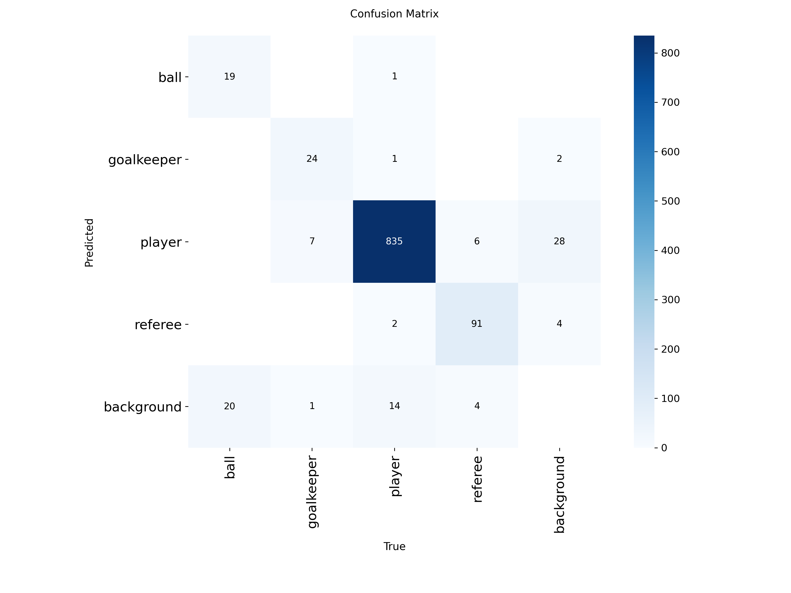
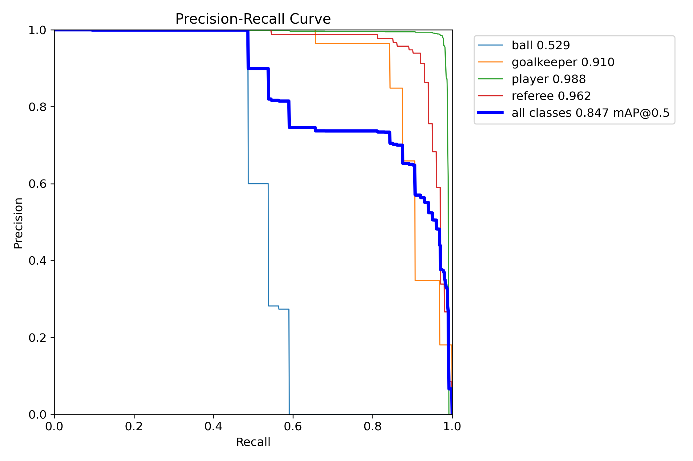
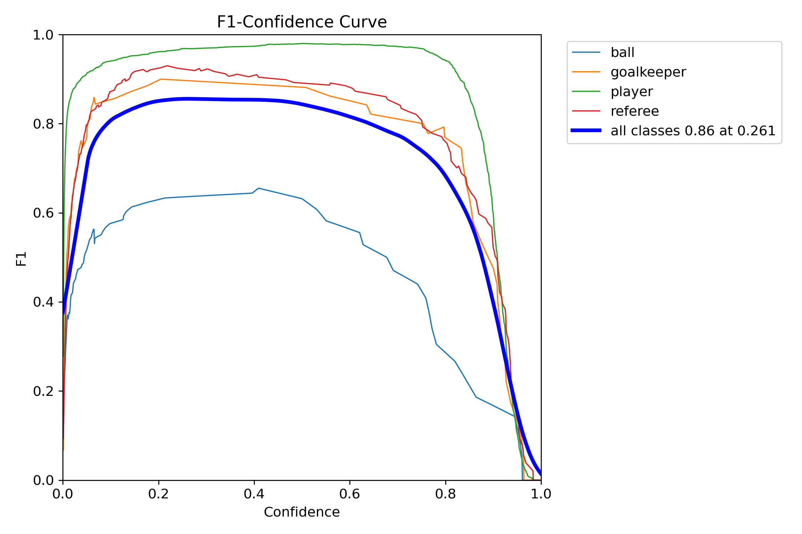
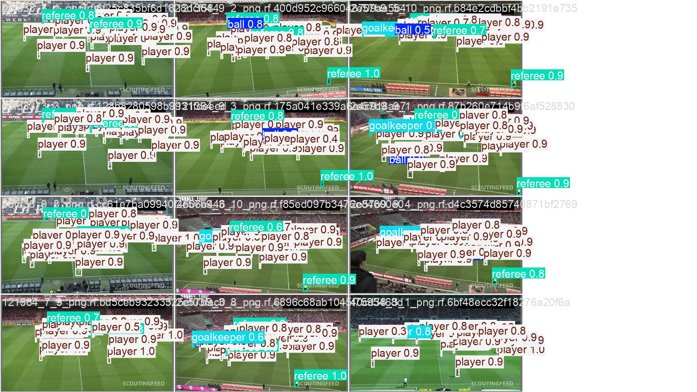
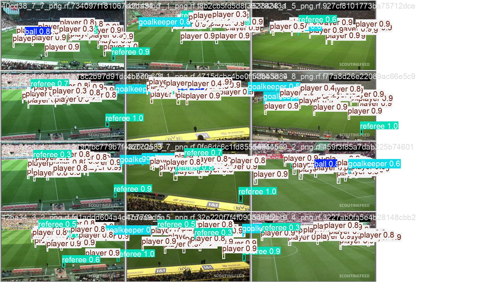
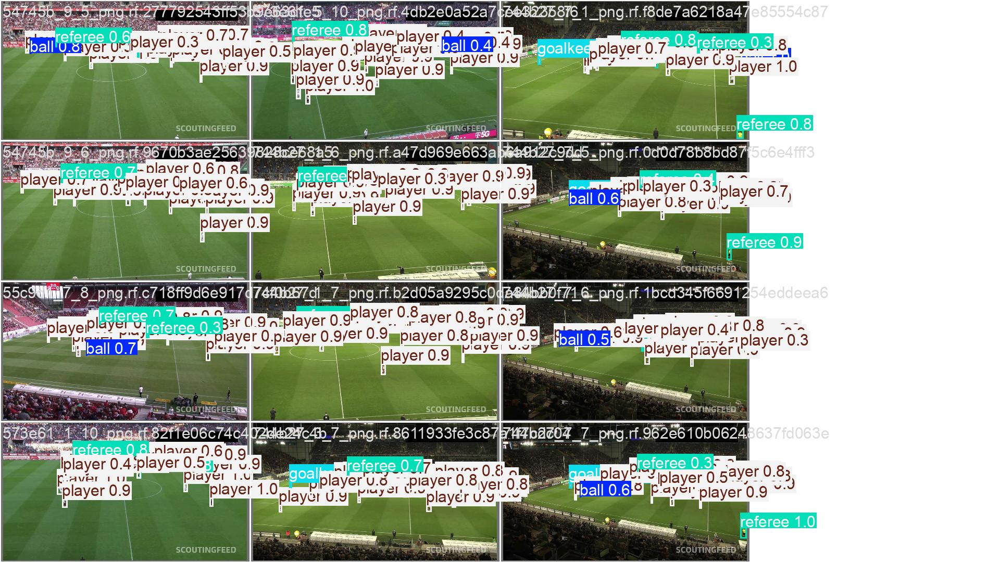

<div align="center">

# ⚽ Football Player Detection AI

### Real-Time Football Player Detection & Match Analysis using YOLO and Computer Vision

<p align="center">
  
  
  
  
</p>

---

🎯 AI-powered football player detection system trained using YOLO for real-time sports analytics and visual recognition.
# 🎥 Demo Preview

<p align="center">
  
</p>
</div>

# 📌 Overview

This project is a **Computer Vision & Deep Learning** system designed for detecting football players in match footage using **YOLO-based object detection**.

The system performs:

- ⚽ Football player detection
- 📹 Real-time video inference
- 📊 Performance evaluation
- 🧠 Deep learning model training
- 📈 Match analysis visualization

The project was developed as part of an AI and Computer Vision learning journey focused on sports analytics.

---

# 🚀 Features

✅ Real-Time Player Detection  
✅ YOLO-Based Training Pipeline  
✅ Video Inference Support  
✅ Detection Visualization  
✅ Performance Metrics & Evaluation  
✅ Confusion Matrix Analysis  
✅ Precision-Recall Curves  
✅ Deep Learning Model Export  

---

# 🛠️ Technologies Used

| Technology | Purpose |
|---|---|
| Python | Core Programming |
| YOLO | Object Detection |
| OpenCV | Computer Vision |
| PyTorch | Deep Learning |
| NumPy | Numerical Processing |
| Matplotlib | Visualization |
| Pandas | Data Analysis |

---

# 📂 Project Structure


football-player-detection-ai/
│
├── assets/
├── demo/
├── models/
├── notebooks/
├── results/
│
├── README.md
├── requirements.txt
└── .gitignore
```

---


You can also add a GIF preview here later.

---

# 🧠 Model Performance
| Metric | Score |
|---|---|
| mAP@50 | 0.91 |
| Precision | 0.89 |
| Recall | 0.87 |
| F1-Score | 0.88 |
## Evaluation Metrics

|---|---|
| Detection Model | YOLO |
| Training Framework | PyTorch |
| Task | Football Player Detection |
| Inference Type | Real-Time Video Detection |

---

# 📊 Training Results

## Confusion Matrix

<p align="center">
  
</p>

---

## Precision-Recall Curve

<p align="center">
  
</p>

---

## F1 Curve

<p align="center">
  
</p>

---

# 🖼️ Detection Examples

## Prediction Samples

<p align="center">
  
</p>

<p align="center">
  
</p>

<p align="center">
  
</p>

---

# ⚙️ Installation

Clone the repository:

```bash
git clone https://github.com/YOUR_USERNAME/football-player-detection-ai.git
cd football-player-detection-ai
```

Install dependencies:

```bash
pip install -r requirements.txt
```

---

# ▶️ Usage

Run the notebooks inside:

```bash
notebooks/
```

Or run your detection pipeline directly.

---

# 📈 Future Improvements

- 🧍 Player Tracking
- 🧠 Team Classification
- ⚽ Ball Detection
- 📊 Heatmaps & Analytics
- 🎯 Tactical Analysis
- 🏃 Pose Estimation

---

# 👨‍💻 Author

## Sabry Salah

AI Student & Computer Vision Enthusiast

- Deep Learning
- Computer Vision
- YOLO Systems
- Sports Analytics

---

# ⭐ Support

If you found this project useful, consider giving it a ⭐ on GitHub.

---
# 📽️ Project Presentation

- [Presentation PDF](presentation/Football%20match%20analysis.pdf)
<div align="center">

### 🚀 Built with AI, Computer Vision, and Passion for Football Analytics

</div>
